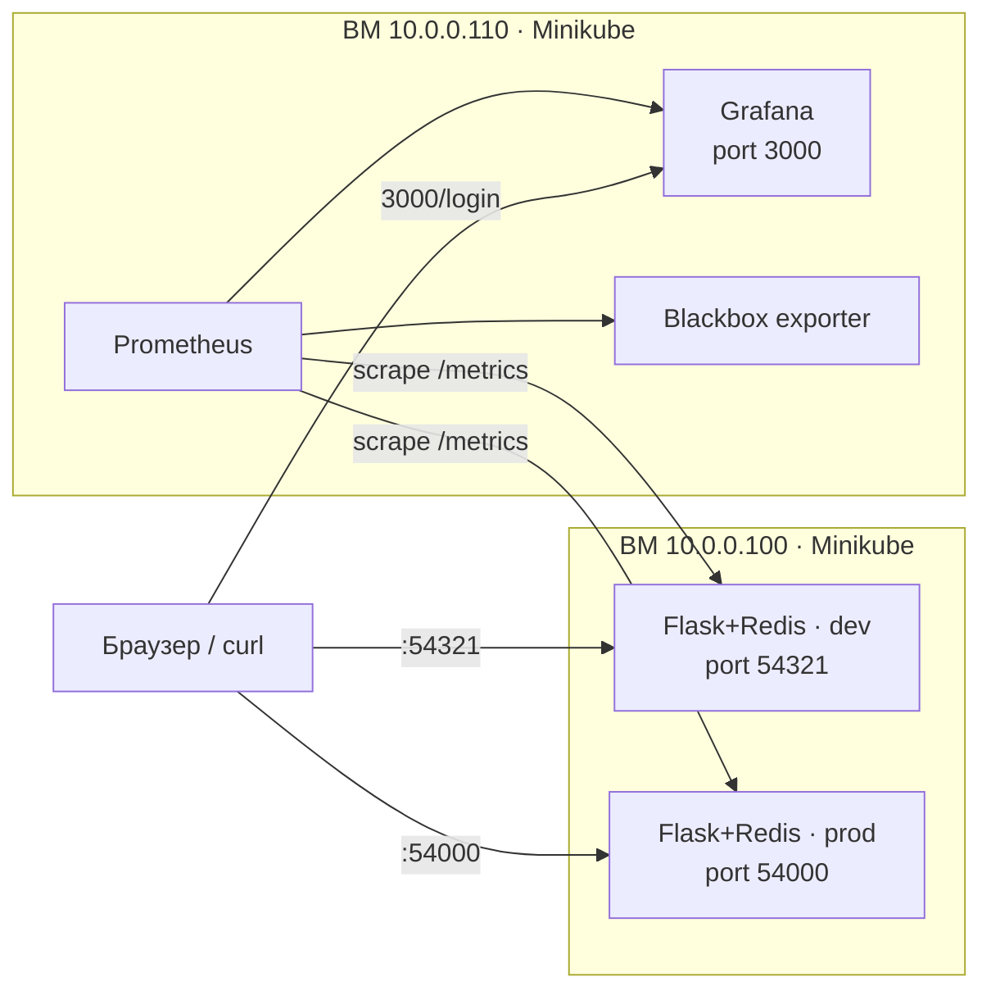

# Лабораторная работа №8 — Helm, Kompose, Kustomize

Курс **DevOps (СИТУ)**. Работа выполнена на базе предыдущих лабораторных
(**ЛР №6** — docker-compose проекты `flask-redis` и `prometheus-grafana`,
**ЛР №7** — k8s basics).

---

## 🎯 Цель работы

На базе предыдущего задания (k8s basics):

1. Доработать приложение — вынести имя сервера (Redis) в переменную окружения.
2. Добавить оверлейную кастомизацию для запуска приложения `flask + redis`
   в окружениях **prod** и **dev**.

Дополнительно:

1. Из проекта `prometheus-grafana` создать **Helm-chart** (через **Kompose**)
   и развернуть его в Kubernetes.
2. Из проекта `flask-app` создать **prod** и **dev** окружения через **Kustomize**.

---

## 🧩 Инструменты

| Инструмент | Назначение |
|------------|------------|
| **Helm**      | Шаблонизация манифестов, вынос параметров в `values.yaml` |
| **Kompose**   | Конвертер docker-compose манифестов в k8s ресурсы / helm-chart |
| **Kustomize** | Переопределение параметров готовых манифестов через патчи (overlays) |
| **Minikube**  | Локальный кластер Kubernetes |

> **Ключевая идея:**
> *Helm* — мы **шаблонизируем** манифесты и выносим параметры в Values.
> *Kustomize* — мы **переопределяем** параметры готовых манифестов через патчи, не меняя исходники.

---

## 🗺️ Архитектура стенда

Работа развёрнута на двух виртуальных машинах:

| IP-адрес     | Роль |
|--------------|------|
| `10.0.0.100` | Flask + Redis (Kustomize: dev / prod) |
| `10.0.0.110` | Prometheus + Grafana + Blackbox (Helm / Kompose) |



---

## 📁 Структура репозитория

```text
lab8/
├── flask_redis/                     # Часть 1 — Kustomize (ВМ 10.0.0.100)
│   ├── base/                        # Базовые манифесты (общие для всех окружений)
│   │   ├── flask_redis/
│   │   │   ├── app.py               # доработанное приложение (REDIS_HOST, ENV)
│   │   │   ├── Dockerfile
│   │   │   └── requirements.txt
│   │   ├── flask-service.yml
│   │   ├── flask.yml
│   │   ├── redis-service.yml
│   │   ├── redis.yml
│   │   └── kustomization.yaml       # базовая кастомизация + общие лейблы
│   ├── dev/                         # overlay dev
│   │   ├── kustomization.yaml
│   │   ├── service-patch.yaml       # порт 54321
│   │   └── deployment-patch.yaml    # 2 реплики, REDIS_HOST=dev-redis, ENV=DEVELOPMENT
│   └── prod/                        # overlay prod
│       ├── kustomization.yaml
│       ├── service-patch.yaml       # порт 54000
│       └── deployment-patch.yaml    # 5 реплик, REDIS_HOST=prod-redis, ENV=PRODUCTION
│
├── prometheus_grafana/              # Часть 2 — Helm / Kompose (ВМ 10.0.0.110)
│   ├── compose.yaml                 # исходный docker-compose из ЛР6
│   ├── prometheus/prometheus.yml
│   ├── grafana/datasource.yml
│   └── promgra/                     # helm-chart, полученный из compose
│       ├── Chart.yaml
│       ├── values.yaml
│       └── templates/
│           ├── grafana-deployment.yaml
│           ├── grafana-service.yaml         # LoadBalancer + externalIPs
│           ├── grafana-configmap.yaml
│           ├── prometheus-deployment.yaml
│           ├── prometheus-service.yaml
│           ├── prometheus-configmap.yaml
│           ├── blackbox-deployment.yaml
│           └── blackbox-service.yaml
└── README.md
```

---

# Часть 1. Flask + Redis через Kustomize (ВМ 10.0.0.100)

## 1.1. Доработка приложения — переменные окружения

Основная задача — убрать **хардкод** имени Redis-сервера, потому что
Kustomize добавляет к именам ресурсов префиксы (`dev-`, `prod-`), и хост `redis`
перестаёт резолвиться. Имя сервера и имя окружения вынесены в переменные окружения:

```python
import os
import socket
import redis
from flask import Flask, make_response

DB_HOST = os.getenv('REDIS_HOST', 'redis')   # имя Redis-сервера теперь из ENV
MY_ENV  = os.getenv('ENV', 'unknown')         # имя окружения из ENV

app = Flask(__name__)
cache = redis.Redis(host=DB_HOST, port=6379)

@app.route('/')
def hello():
    incr_hit_count()
    count = get_hit_count()
    return (f'Hello World! I have been seen {count} times. '
            f'My name is: {socket.gethostname()} '
            f'My env: {MY_ENV} Redis host: {DB_HOST}\n')
```

## 1.2. Базовая кастомизация (`base/kustomization.yaml`)

Базовый слой применяется ко всем окружениям и вешает общий лейбл на все ресурсы:

```yaml
labels:
  - includeSelectors: true
    pairs:
      app: devops-course-2025
resources:
  - flask-service.yml
  - flask.yml
  - redis-service.yml
  - redis.yml
```

## 1.3. Overlay dev и prod

Поверх `base` создаются два overlay-слоя с собственными префиксами, лейблами и патчами.

**`dev/kustomization.yaml`:**

```yaml
resources:
  - ../base
namePrefix: dev-
labels:
  - includeSelectors: true
    pairs:
      environment: dev
patches:
  - path: service-patch.yaml
    target:
      labelSelector: 'svc=flask-front'
  - path: deployment-patch.yaml
```

**Патч сервиса (JSON 6902) — меняем внешний порт:**

```yaml
# dev/service-patch.yaml   → порт 54321
- op: replace
  path: /spec/ports/0/port
  value: 54321
```

**Патч деплоймента — реплики и переменные окружения:**

```yaml
# dev/deployment-patch.yaml
apiVersion: apps/v1
kind: Deployment
metadata:
  name: flask-app
spec:
  replicas: 2
  template:
    spec:
      containers:
        - name: flask
          env:
            - name: REDIS_HOST
              value: dev-redis
            - name: ENV
              value: DEVELOPMENT
```

Для **prod** — аналогично: порт `54000`, `5` реплик, `REDIS_HOST=prod-redis`, `ENV=PRODUCTION`.

## 1.4. Сборка образа и применение

```bash
# сборка образа внутри Minikube
minikube image build -t flask:v2 ./flask_redis/base/flask_redis

# проверка кастомизации без применения
kubectl kustomize dev
kubectl kustomize prod

# применение в кластер
kubectl apply -k dev
kubectl apply -k prod
```

## 1.5. Проверка

```bash
curl http://10.0.0.100:54321/     # dev  → My env: DEVELOPMENT  Redis host: dev-redis
curl http://10.0.0.100:54000/     # prod → My env: PRODUCTION   Redis host: prod-redis
```

### ✅ Результат
Из **одного** базового проекта, **не меняя исходные манифесты**, развернули сервис
параллельно в два окружения. В каждом окружении свои:
- имена ресурсов;
- лейблы;
- переменные окружения;
- количество реплик;
- настройки сервисов (порт).

---

# Часть 2. Prometheus + Grafana + Blackbox через Helm / Kompose (ВМ 10.0.0.110)

## 2.1. Установка инструментов

```bash
# Helm
curl -fsSL -o get_helm.sh https://raw.githubusercontent.com/helm/helm/main/scripts/get-helm-3
chmod 700 get_helm.sh && ./get_helm.sh

# Kompose
curl -L https://github.com/kubernetes/kompose/releases/download/v1.34.0/kompose-linux-amd64 -o kompose
chmod +x kompose && sudo mv ./kompose /usr/local/bin/kompose
```

## 2.2. Генерация Helm-chart из docker-compose

```bash
kompose convert --chart -f compose.yaml
mv compose promgra          # переименовываем каталог чарта
```

Kompose создаёт базовую структуру чарта; настройки файлов (`prometheus.yml`,
`datasource.yml`) попадают в **ConfigMap**.

## 2.3. Доработка чарта

- В `Chart.yaml` — имя чарта `promgra`.
- Сервис Grafana переведён в тип **LoadBalancer** с указанием **externalIPs**.
- Параметры вынесены в `values.yaml`:

```yaml
# values.yaml
EXTERNAL_IP: "10.0.0.110"
EXTERNAL_PORT: 3000
GF_ADMIN_PASSWORD: "HiGrafana"
```

```yaml
# templates/grafana-service.yaml
spec:
  type: LoadBalancer
  ports:
    - port: {{ .Values.EXTERNAL_PORT }}
      targetPort: 3000
  externalIPs:
    - {{ .Values.EXTERNAL_IP }}
  selector:
    io.kompose.service: grafana
```

## 2.4. Проверка, упаковка и установка

```bash
helm lint ./promgra
helm template promgra ./promgra          # рендеринг всех yaml с подстановкой values
helm package ./promgra                    # упаковка → promgra-0.1.0.tgz

# развёртывание релиза
helm upgrade --install promgra ./promgra-0.1.0.tgz -n monitoring --create-namespace

kubectl get pods -n monitoring
kubectl get services -n monitoring
```

## 2.5. Апгрейд релиза с переопределением значений

```bash
helm upgrade promgra ./promgra --set EXTERNAL_PORT=3456
helm get values promgra                   # только пользовательские значения
helm get values promgra --all             # все значения
```

## 2.6. Проверка

```bash
minikube tunnel --bind-address 10.0.0.110   # проброс LoadBalancer
curl -I http://10.0.0.110:3000/login        # → 200 OK
```

Открыть в браузере **`http://10.0.0.110:3000/login`** (логин `admin`, пароль `HiGrafana`).
Datasource Prometheus подключается автоматически через ConfigMap.

---

## ▶️ Быстрый запуск (Quick Start)

```bash
# --- Предварительно: очистка кластера ---
kubectl delete all --all

# --- ВМ 10.0.0.100: Flask + Redis ---
minikube start
minikube tunnel --bind-address 10.0.0.100 &
minikube image build -t flask:v2 ./flask_redis/base/flask_redis
kubectl apply -k flask_redis/dev
kubectl apply -k flask_redis/prod

# --- ВМ 10.0.0.110: Prometheus + Grafana ---
minikube start
minikube tunnel --bind-address 10.0.0.110 &
cd prometheus_grafana
helm upgrade --install promgra ./promgra -n monitoring --create-namespace
```

---

## 🧾 Проверочные эндпоинты

| Проверка | Команда / URL | Ожидаемо |
|----------|---------------|----------|
| Flask dev  | `curl http://10.0.0.100:54321/` | `My env: DEVELOPMENT  Redis host: dev-redis` |
| Flask prod | `curl http://10.0.0.100:54000/` | `My env: PRODUCTION   Redis host: prod-redis` |
| Метрики    | `curl http://10.0.0.100:54321/metrics` | `view_count{...}` |
| Grafana    | `http://10.0.0.110:3000/login` | Страница входа (admin / HiGrafana) |
| Prometheus | `http://10.0.0.110:9090/targets` | Flask dev/prod в состоянии **UP** |

---

## ✅ Выводы

- Приложение доработано: имя Redis-сервера и имя окружения вынесены в переменные
  окружения (`REDIS_HOST`, `ENV`) — устранён хардкод.
- С помощью **Kustomize** из одного базового набора манифестов развёрнуты два
  окружения (**dev** и **prod**) с разными именами, лейблами, портами, количеством
  реплик и переменными окружения — **без изменения исходных манифестов**.
- С помощью **Kompose** из docker-compose проекта сгенерирован **Helm-chart**,
  доработан (LoadBalancer, externalIPs, вынос параметров в `values.yaml`),
  упакован и развёрнут в Kubernetes.
- Prometheus собирает метрики с обоих окружений Flask, Grafana доступна извне
  с автоматически подключённым datasource.

> **Главный принцип:** разработчики должны соблюдать культуру и **не хардкодить**
> параметры — только тогда декларативные кастомизации работают корректно.
